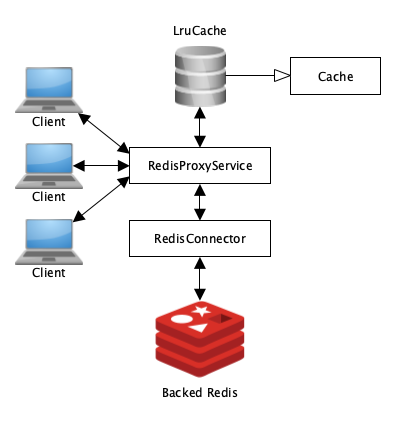

# Redis Proxy

The Redis proxy is implemented in Scala (version 2.13) using the [Akka toolkit](https://akka.io/) and
[scala-redis](https://github.com/debasishg/scala-redis).

## Running and building

To run tests execute: `make test`

This will automatically start a Redis instance used for integration testing.

To run the proxy the Redis proxy execute: `make run`

## Configuration

The proxy can be configured through environment variables that are stored in the `.env` file:

```
PORT=9090
CACHE_SIZE=1000
MAX_CACHE_LIFETIME=100000	# milliseconds
REDIS_HOST="redis"
REDIS_PORT=6379
```

Or by changing the `application.conf` file in the `src/main/resources` directory. `application.conf` contains additional
settings, for example to specify the maximum number of concurrently connected clients.

## Architecture and documentation

A generated API documentation can be found in the `api/` directory and viewed by opening `index.html`.

### Architecture

The following figure shows an overview of the different components the system is composed of:



Clients can connect to `RedisProxyService` and send HTTP requests. `RedisProxyService` will process requests concurrently
by making use of its [actor model](https://doc.akka.io/docs/akka/2.5.3/scala/guide/actors-intro.html).
Depending on the request type or whether the accessed entry is cached, `RedisProxyService` accesses the `LruCache` or the 
backing Redis instance it is connected to via a `RedisConnector`.

The `LruCache` implements the generic `Cache` trait and could be easily replaced by another cache implementation. `LruCache`
also allows concurrent access by multiple clients and is thread-safe by using `ConcurrentLinkedHashMap` for its internal storage.
The `LruCache` has a maximum size that can be configured and entries have a configurable expiration time. When accessing the cache, 
the expiration time for the accessed entry gets updated.

### API

Supported operations:

* Access value: `GET /GET/<key>`
* Store key-value pair: `POST /SET`
    * Request body (JSON): `{"key": <key>, "value": "<value>"}`
        * Currently `<value>` needs to be a string
* Remove key-value pair from cache and Redis: `DELETE /DEL/<key>`

### Used libraries and toolkits

* _akka-actor_: Akka toolkit, provides the actor system and support for creating HTTP servers.
* _config_: Library that allows usage of external configuration files. Configuration files are stored in the `src/main/resources` directory and can be easily accessed using this library.
* _akka-testkit_: Testkit required for testing Akka actors.
* _scalatest_: Testing framework for Scala.
* _akka-http-core_ and _akka-http_: Akka framework for creating HTTP servers.
* _concurrentlinkedhashmap-lru_: A high performance version of java.util.LinkedHashMap for use as a software cache.
* _joda-time_: Date and time classes.
* _redisclient_: Redis client library for Scala.
